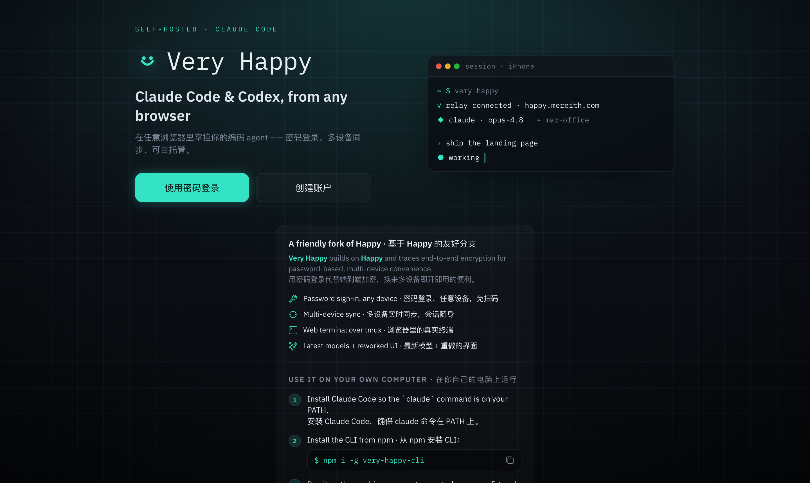
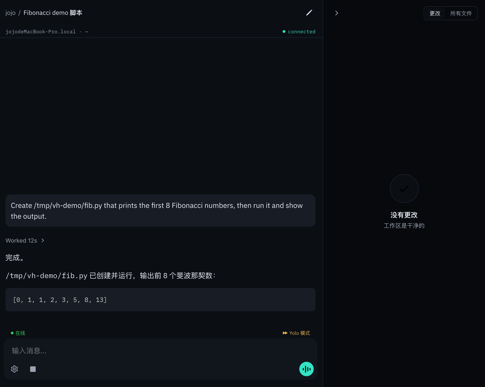
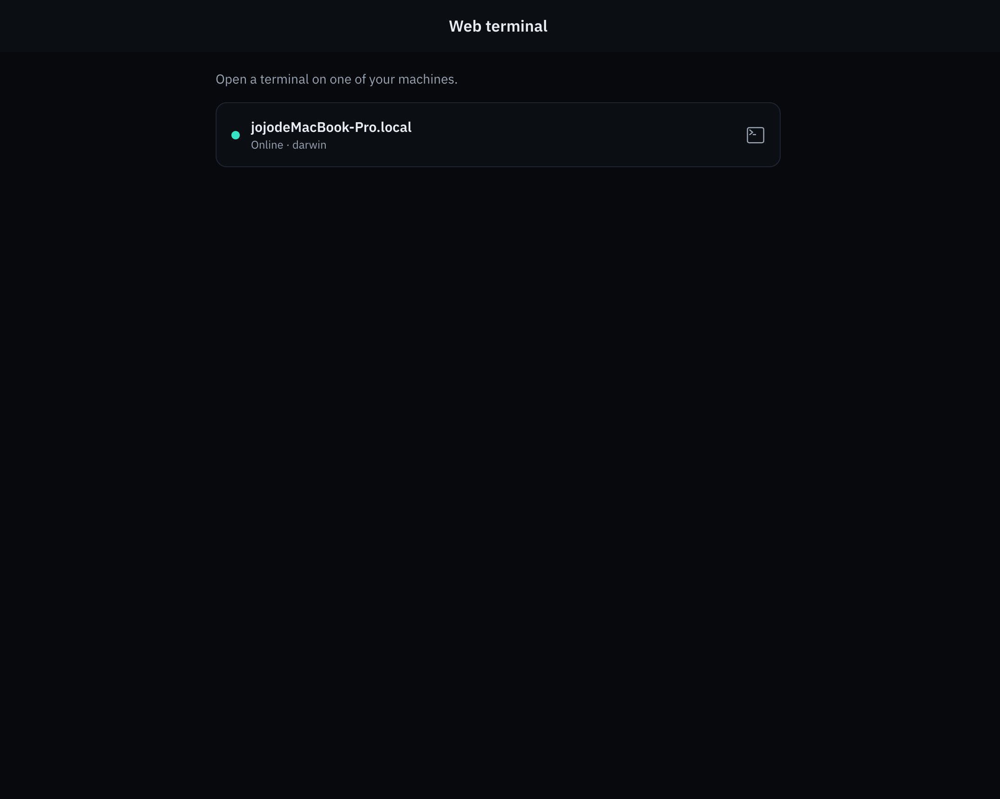

<div align="center">
  <picture>
    <source media="(prefers-color-scheme: dark)" srcset="/.github/logotype-light.png">
    <source media="(prefers-color-scheme: light)" srcset="/.github/logotype-dark.png">
    
  </picture>
</div>

<h1 align="center">
  Drive Claude Code from any browser
</h1>

<h4 align="center">
Sign in with a password, pick up your coding sessions on any device — no app store, no QR code.<br>
用密码登录，在任意设备上接续你的编码会话 —— 无需应用商店、无需扫码。
</h4>

<p align="center"><b>English</b> · <a href="#中文说明">中文</a></p>

---

**Very Happy** is a friendly fork of [slopus/happy](https://github.com/slopus/happy) (MIT) — a web + mobile client and relay that lets you watch and steer [Claude Code](https://www.anthropic.com/claude-code) from your phone or any browser. The upstream project is excellent; Very Happy reworks it around a different trade-off — **convenience over end-to-end encryption** — and adds a heavily polished web UI, a "Console" dark/light redesign, and an in-browser web terminal.

<div align="center">
  
  <br><br>
  
  
</div>

## What's different from Happy

Upstream Happy is end-to-end encrypted and pairs devices by scanning a QR code. Very Happy deliberately takes the opposite stance to make self-hosting for a small, trusted group effortless:

- 🔑 **Password accounts, no pairing** — create an account with a username + password and sign in on any device. No QR code, no re-linking. Your sessions follow you everywhere.
- 🔁 **Multi-device sync** — start on your laptop, keep going on your phone, finish in a browser tab. Same session, instantly.
- 🌐 **Web-first** — runs entirely in the browser. Install it to your home screen as a PWA if you want; you never need an app store.
- 🔔 **Web push notifications** — get notified when your agent needs permission or finishes, even with the tab closed (iOS 16.4+ as an installed PWA).
- 🖥️ **Web terminal** — open a real terminal on any connected machine, right in the browser, and run Claude Code or anything else. Each tab is backed by its own `tmux` session, so you can `tmux attach` to the same session locally and share it.
- 🧠 **Reworked session UI** — inline thinking, per-turn model / token usage / cost / duration, tool calls that expand to the full command and output, automatic session titles (with manual rename), a file sidebar, and a mono **status line** (machine · cwd · model · connection) on every session.
- 🎨 **"Console" design** — a cohesive dark/light theme ("a terminal you wear, not another chat app"): one teal accent reserved for *live* state, a unified flat session/terminal list, and a much-slimmed settings tree.
- ⚡ **Latest models** — bumped to a current Claude Agent SDK so remote sessions run the newest models (e.g. Opus 4.8), not whatever an app-store build happened to ship.
- 🏠 **Self-hostable & invite-gated** — bring your own relay and gate signups with invite codes.

Everything else — the CLI wrapper, the agent runtime, the two execution paths (interactive vs. SDK) — comes from upstream Happy and keeps working.

> [!IMPORTANT]
> **Very Happy is server-trusted, not end-to-end encrypted.** Your sessions are relayed through the server, and its operator can decrypt and read their contents. This is an intentional trade-off for password-based multi-device sync. Only sign up on an instance run by someone you trust, and only host an instance for people who trust you. If you need true end-to-end encryption, use [upstream Happy](https://github.com/slopus/happy) instead.

## Try it

There's a public instance at **[happy.mereith.com](https://happy.mereith.com)** you can kick the tires on. Open it, create an account, and once you've run the CLI (steps below) your machine shows up.

> [!WARNING]
> The public instance is a personal demo, **not a service**. It is **server-trusted** (the operator can read your sessions), accounts and data **may be wiped at any time**, and there is **no uptime guarantee**. **Don't enter real secrets or credentials, and don't point production machines at it.** For real use, **self-host** (see below) so nothing leaves infrastructure you control.

## Getting started

**Step 1 — Install Claude Code** so the `claude` command is on your `PATH`.

**Step 2 — Install the Very Happy CLI** on the machine you want to control:

```bash
npm install -g very-happy-cli
```

**Step 3 — Run it** (pre-configured to reach the public demo above):

```bash
very-happy
```

Then open the web app, create an account, and your machine appears.

## Self-host your own instance

For anything beyond a quick try, run your own relay so your sessions never leave infrastructure you control.

1. **Server** — `packages/happy-server` is a Node + Postgres relay that also serves the web app. Configure its environment (database URL, signing secrets, optional invite codes) and deploy it behind TLS.
2. **Web** — build the Expo web app in `packages/happy-app` and serve it from the relay (or any static host).
3. **CLI / daemon** — point the CLI at your relay and run it on each machine you want to control:

   ```bash
   HAPPY_SERVER_URL=https://your-relay.example.com very-happy
   ```

See [`RELEASING.md`](RELEASING.md) for the exact npm + CI release/deploy runbook (tag-driven publish, manual server/web deploy over SSH).

## How it works

```
web client ──▶ relay server ──socket──▶ very-happy CLI daemon ──spawn──▶ claude (Claude Code)
```

On your computer you run `very-happy` instead of `claude`. When you take control from your phone or a browser, the daemon runs Claude Code via the Claude Agent SDK in remote mode and streams everything back to you. Same engine, tools, skills, subagents, hooks and MCP as the real CLI.

## Project components

- **happy-app** — web + mobile client (Expo)
- **happy-cli** — the `very-happy` command-line wrapper for Claude Code
- **happy-server** — relay + sync backend, and it also hosts the web app
- **happy-agent** / **happy-wire** — remote agent control + shared protocol

## Credits & license

Very Happy is a fork of [**slopus/happy**](https://github.com/slopus/happy) — huge thanks to the Happy authors and contributors for the foundation. Licensed under the MIT License; see [LICENSE](LICENSE).

---

## 中文说明

**Very Happy** 是 [slopus/happy](https://github.com/slopus/happy)（MIT）的一个友好分支 —— 一个 Web + 移动客户端及中继服务，让你从手机或任意浏览器里观看、接管 [Claude Code](https://www.anthropic.com/claude-code)。上游项目很棒；Very Happy 在它基础上做了一个不同的取舍 —— **以便利换取端到端加密** —— 并重做了 Web UI、加了「Console」明暗主题和浏览器内的 Web 终端。

### 与 Happy 有什么不同

- 🔑 **密码账号、免配对** —— 用用户名 + 密码创建账号，在任意设备登录。无需扫码、无需重新绑定，会话随身。
- 🔁 **多设备同步** —— 笔记本上开始、手机上继续、浏览器里收尾，同一个会话即时同步。
- 🌐 **Web 优先** —— 完全在浏览器里跑，可作为 PWA 添加到主屏，永远不用应用商店。
- 🔔 **Web 推送通知** —— agent 需要授权或完成时通知你，即使标签页关着（iOS 16.4+ 装成 PWA）。
- 🖥️ **Web 终端** —— 在任意已连接的机器上，直接在浏览器里开一个真实终端，跑 Claude Code 或任何命令。每个终端由独立的 `tmux` 会话支撑，本地也能 `tmux attach` 接同一个会话。
- 🧠 **重做的会话界面** —— 内联思考、每轮的模型/用量/成本/耗时、可展开完整命令与输出的工具调用、自动会话标题（可手动改名）、文件侧栏，以及每个会话顶部的等宽**状态条**（机器 · cwd · 模型 · 连接）。
- 🎨 **「Console」设计** —— 一致的明暗主题（「穿在身上的终端，而不是又一个聊天框」）：唯一的 teal 强调色只用于*在线/活跃*状态、对话与终端统一的扁平列表、大幅精简的设置层级。
- ⚡ **最新模型** —— 升级到当前的 Claude Agent SDK，远程会话跑最新模型（如 Opus 4.8），而不是某个应用商店构建里固化的版本。
- 🏠 **可自托管、可邀请码限流** —— 自带中继、用邀请码控制注册。

> [!IMPORTANT]
> **Very Happy 是「服务器可信」的，不是端到端加密。** 你的会话经服务器中继，服务器运营者能解密并读取其内容。这是为了密码登录、多设备同步而做的有意取舍。只在你信任的人运营的实例上注册，也只为信任你的人托管实例。若你需要真正的端到端加密，请用[上游 Happy](https://github.com/slopus/happy)。

### 试用

公开实例在 **[happy.mereith.com](https://happy.mereith.com)**，可以上去体验：打开它、注册账号，按下面的步骤跑起 CLI 后，你的机器就会出现。

> [!WARNING]
> 这个公开实例是个人 demo，**不是一项服务**。它是**服务器可信**的（运营者能读你的会话），账号和数据**随时可能被清空**，且**没有可用性保证**。**不要填入真实密钥或凭据，也不要把生产机器连上去。** 正式使用请**自部署**（见下），让数据不离开你掌控的基础设施。

### 快速开始

1. **安装 Claude Code**，确保 `claude` 命令在 `PATH` 上。
2. 在你想控制的机器上**安装 CLI**：`npm install -g very-happy-cli`
3. **运行**（已预设连到上面的公开 demo）：`very-happy`

然后打开 Web 应用、注册账号，你的机器就会出现。

### 自部署

正式使用就跑你自己的中继，让会话不离开你掌控的设施：

1. **服务端** —— `packages/happy-server` 是一个 Node + Postgres 中继，同时托管 Web 应用。配置好环境（数据库、签名密钥、可选邀请码）并部署在 TLS 后。
2. **Web** —— 构建 `packages/happy-app` 的 Expo Web 应用，从中继（或任意静态托管）提供。
3. **CLI / daemon** —— 把 CLI 指向你的中继，在每台要控制的机器上运行：`HAPPY_SERVER_URL=https://your-relay.example.com very-happy`

发布/部署流程见 [`RELEASING.md`](RELEASING.md)。

### 工作原理

```
Web 客户端 ──▶ 中继服务器 ──socket──▶ very-happy CLI 守护进程 ──spawn──▶ claude (Claude Code)
```

在你的电脑上用 `very-happy` 代替 `claude`。当你从手机或浏览器接管时，守护进程通过 Claude Agent SDK 以远程模式运行 Claude Code，把一切流式传回给你 —— 引擎、工具、skills、子 agent、hooks 和 MCP 都和真实 CLI 一致。

### 致谢与许可

Very Happy 是 [**slopus/happy**](https://github.com/slopus/happy) 的分支 —— 非常感谢 Happy 的作者与贡献者打下的基础。MIT 许可，见 [LICENSE](LICENSE)。
</content>
</invoke>
