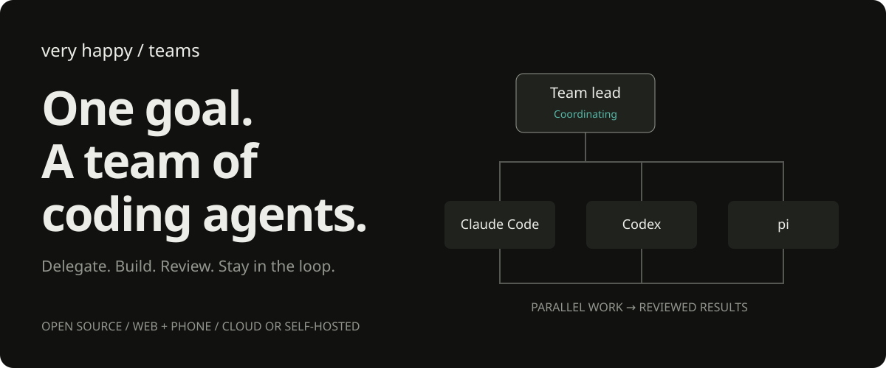
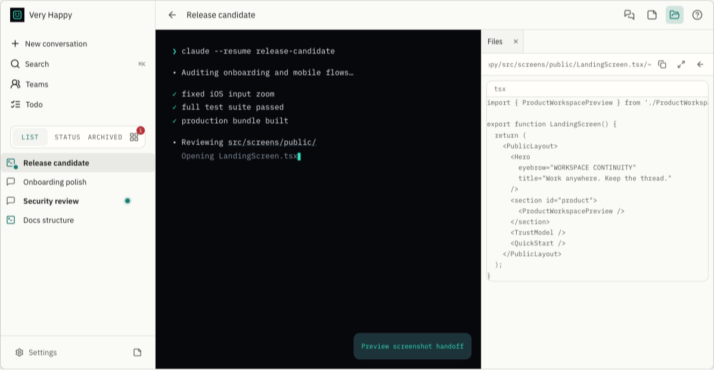
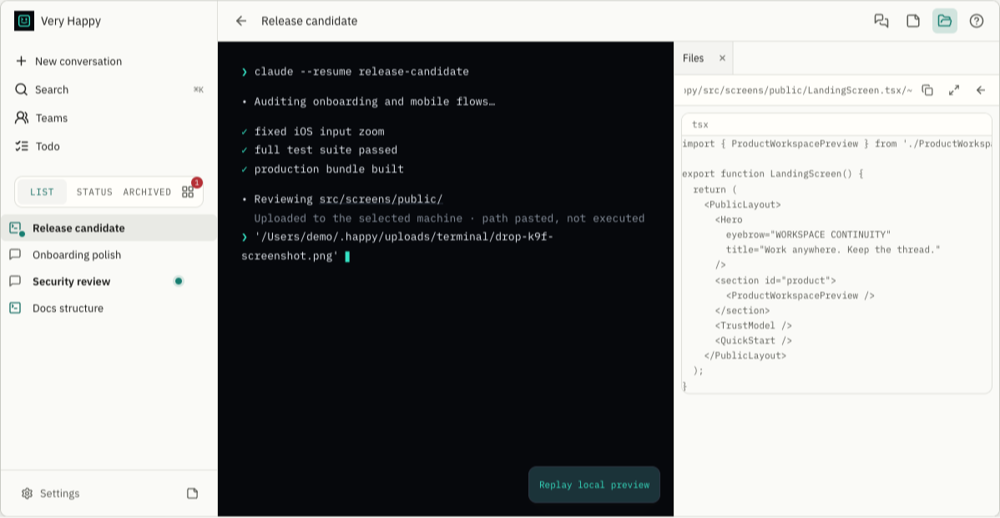

<div align="center">
  <a href="https://happy.mereith.com/welcome">
    
  </a>
</div>

<p align="center">
  <strong>Your agents keep working. Your context stays intact. You get to be Very Happy.</strong>
</p>

<p align="center">
  
  
  
  
  
</p>

<p align="center">
  <a href="https://happy.mereith.com/welcome"><strong>Explore the live workspace</strong></a>
  &nbsp;·&nbsp;
  <a href="#one-command-to-your-first-machine">Connect a machine</a>
  &nbsp;·&nbsp;
  <a href="docs/README.md">Read the docs</a>
  &nbsp;·&nbsp;
  <a href="docs/deployment.md">Self-host</a>
</p>

Very Happy is an open agent workspace for computers you control. It combines
structured agent conversations, the real terminal interface, files, tasks,
notes, notifications, and coordination in one responsive Web UI—then keeps that
work reachable from a laptop, phone, tablet, or installed PWA.

It is not a browser repaint of one vendor's CLI and it is not merely a remote
shell. Very Happy preserves the surrounding thread: what is running, what the
agent changed, which machine owns the work, what needs your decision, and how to
continue after an interruption.

> [!IMPORTANT]
> **Very Happy is server-trusted, not end-to-end encrypted.** The relay operator,
> or an attacker controlling the relay, can recover account material, access
> relayed content, and act through capabilities exposed by connected daemons.
> Use only an operator you trust. Self-hosting changes who you trust; it does not
> turn the architecture into zero knowledge. Read the
> [security model](docs/security.md) before connecting a sensitive machine.

## One workspace. Two levels of abstraction.

<table>
  <tr>
    <td width="33%" valign="top">
      <h3>STRUCTURED</h3>
      Follow messages, tools, diffs, permissions, usage, and resume state without
      living inside terminal chrome. Claude Code is the deepest structured
      integration today.
    </td>
    <td width="33%" valign="top">
      <h3>THE REAL TUI</h3>
      Run the actual agent CLI/TUI inside a tmux-owned TTY. Reconnect to the same
      process, keep scrollback, search it, browse files, and use touch-first
      terminal controls.
    </td>
    <td width="33%" valign="top">
      <h3>CONTINUOUS</h3>
      Start at a desk, check progress on a phone, and return without rebuilding
      the project state in your head. An optional Claude-only mirror can move
      between a hand-started TUI and structured conversation.
    </td>
  </tr>
</table>

```text
Claude Agent SDK ──────────────> structured conversation

real agent CLI ──> tmux TTY ──> browser terminal ──> phone / laptop / PWA
                         ╰─────> optional Claude mirror ───────╯
```

The paths are deliberately different. An agent working in a terminal does not
automatically expose Claude-style structured events. Durable terminals require
`tmux`; the optional Claude mirror requires `tmux` 3.2 or newer. Without tmux,
Web terminals use a non-persistent direct-shell fallback.

<a href="https://happy.mereith.com/welcome">
  
</a>

<p align="center"><sub>THE REAL PRODUCT UI · SANITIZED DATA · SIDEBAR + TERMINAL + FILE PREVIEW</sub></p>

### Clipboard → target machine, without the detour

Paste a screenshot or drag a file straight into a Very Happy browser terminal.
The daemon receives it on the selected machine under
`~/.happy/uploads/terminal/`, then Very Happy pastes a path quoted for the
daemon's default shell at the terminal cursor. It never presses Enter for you.
Native Windows insertion requires the current daemon so the Web client can
distinguish cmd from PowerShell.

```text
phone / laptop clipboard  ── trusted relay ──>  selected machine
dragged file or screenshot                     ~/.happy/uploads/terminal/…
                                                        │
                                                        ╰─> shell-quoted path at cursor
```

<a href="https://happy.mereith.com/welcome#proofs">
  
</a>

<p align="center"><sub>PASTE OR DROP · BOUNDED MACHINE RPC · ATOMIC TARGET FILE · NO AUTO-RUN</sub></p>

Terminal handoffs are capped at 8 MB, transferred in bounded chunks, and shown
with progress/error feedback. Older daemons retain the previous small-file
path; update the CLI and restart the daemon for larger files. Because the relay
is trusted, do not transfer a file through an operator you would not trust with
its contents.

## Why choose Very Happy?

| The friction | What carries it for you |
|---|---|
| “I left my desk, so the work stopped being legible.” | A responsive Web/PWA workspace with mobile conversation, terminal, files, tasks, notifications, and Home Screen installation. |
| “Structured chat is pleasant, but sometimes I need the actual tool.” | Keep SDK-backed Claude and drop into a durable, unmodified agent TTY/TUI when necessary. |
| “Every session is another pile of context to remember.” | Session organization, file context, task board, todos, notes, status, and an optional coordinating meta-agent. |
| “One model vendor should not own my whole workspace.” | Claude Code and Codex today; beta Gemini/OpenCode through Agent Client Protocol; OpenClaw through its own local gateway. |
| “Remote control must fit my security boundary.” | Use the capacity-limited community Cloud or deploy the same server-trusted relay under your control. |
| “Keyboard speed disappears on the Web.” | A production command palette plus shortcuts for switching work, saved prompts, notes, new terminals, and navigation—with touch equivalents. |
| “The file I need is on the device in my hand, not the machine doing the work.” | Paste a screenshot or drop a file into the browser terminal; its shell-quoted path appears on the selected machine without auto-running a command. |

The philosophy is straightforward: stay high-level when that is faster, drop to
the raw machine when it is necessary, and make the interface carry as much
operational overhead as possible.

## One command to your first machine

On macOS or Linux, the hosted Cloud path can install the CLI, run diagnostics,
open the one-time browser approval, and start the detached daemon in one command:

```bash
(
  set -eu
  vh_installer=$(mktemp)
  trap 'rm -f "$vh_installer"' \
    EXIT HUP INT TERM
  curl -fsSL \
    https://happy.mereith.com/install.sh \
    -o "$vh_installer"
  sh "$vh_installer"
)
```

The bootstrap is intentionally boring where trust matters. It:

1. verifies a supported Node.js runtime;
2. resolves the npm `latest` tag once, validates it, and installs that exact
   `very-happy-cli` version;
3. runs `very-happy doctor` without intentionally reading provider credential
   values (review all diagnostic output before sharing it);
4. opens the normal short-lived Web approval flow; and
5. runs `very-happy daemon start` so the machine actually appears online.

The command downloads the complete script to a random temporary file before it
runs and removes it afterward. It never invokes `sudo`, installs tmux, writes
provider credentials, enables Claude hooks, or hides the trusted-relay warning.
Hosted bytes can change with a Web release: for the auditable path, download the
[version-controlled script](packages/happy-web-v2/public/install.sh), compare it,
then run the local file. Its offline no-mutation preview is:

```bash
sh ./install.sh --dry-run
```

The script can connect terminal-based agents without a Claude credential. For
structured Claude, configure a supported provider credential in the daemon's
startup environment. If you add it after the bootstrap has started the daemon,
reload that environment with:

```bash
very-happy daemon stop && very-happy daemon start
```

<details>
<summary><strong>Prefer the fully manual path?</strong></summary>

```bash
npm install --global very-happy-cli
very-happy doctor
very-happy auth login
very-happy daemon start
```

Approve only a machine request you just initiated. Then open
[happy.mereith.com](https://happy.mereith.com), choose the connected machine,
and create your first session.

</details>

### Machine requirements

| Requirement | Status | Why |
|---|---:|---|
| Node.js 20.19+ within 20.x, 22.13+ within 22.x, or 24+, with npm | Required | Runs the CLI and daemon |
| Agent provider/runtime | Per agent | Structured Claude uses the bundled Agent SDK plus provider credentials; native terminals and other adapters need their local command or gateway |
| `tmux` | Recommended | Keeps real Web terminals alive across browser disconnects |
| `tmux` 3.2+ | Optional Claude mirror | Provides the create-time environment markers used by terminal → structured handoff |

For the first structured Claude session, configure `ANTHROPIC_API_KEY` or a
supported Bedrock, Vertex AI, or Foundry environment for the same OS user and
startup environment that runs the daemon. `very-happy doctor` reports only the
credential source category. See
[configuration](docs/configuration.md#claude-credentials-for-structured-sessions).

Provider credentials stay local by default. `very-happy connect` is a separate,
explicit flow that uploads a selected OpenAI, Anthropic, or Gemini OAuth
credential to the trusted relay; it is not an end-to-end encrypted vault and is
currently used primarily by the Gemini path.

### Self-hosted first connection

Deploy the relay first, use HTTPS, then keep all three endpoint variables in the
environment that starts the daemon:

```bash
export HAPPY_HOME_DIR="$HOME/.very-happy-relay.example.com"
export HAPPY_SERVER_URL=https://relay.example.com
export HAPPY_WEBAPP_URL=https://relay.example.com

npm install --global very-happy-cli
very-happy doctor
very-happy auth login
very-happy daemon start
```

Use a separate `HAPPY_HOME_DIR` for each relay. Tokens and machine IDs belong to
the relay that issued them. The supported public self-host path is the pinned
repository Docker build—not the upstream-owned `happy-server-self-host` npm
package. See [Self-hosting](docs/deployment.md).

## Move at thought speed

<p>
  <kbd>⌘ K</kbd> / <kbd>Ctrl K</kbd>
  &nbsp; command palette &nbsp;·&nbsp;
  <kbd>⌘ 1–9</kbd> / <kbd>Ctrl 1–9</kbd>
  &nbsp; switch visible work &nbsp;·&nbsp;
  <kbd>⌘ J</kbd> / <kbd>Ctrl J</kbd>
  &nbsp; notes
</p>

The production command palette searches actions, chats, and terminals. Saved
prompts use `Command/Ctrl+.`; mobile users open the same command surface from
the sidebar Search control.

Very Happy preserves terminal muscle memory: on macOS, `Ctrl+K/J/N/R` stay with
readline and the real TUI. Browser-reserved new/close chords work only where the
platform delivers them to an installed PWA; normal tabs use the explicit
`Alt+N` and `Alt+W` fallbacks. See the precise
[keyboard and touch reference](docs/keyboard-shortcuts.md).

## Agent surface

| Adapter | Status | Experience |
|---|---|---|
| Claude Code | Shipped · deepest integration | Bundled Agent SDK structured sessions; native Claude TUI; optional Claude-only terminal mirror |
| Codex | Shipped | Dedicated Codex session path plus native terminal access |
| Gemini | Beta · implemented | Agent Client Protocol backend and preset |
| OpenCode | Beta · implemented | ACP-compatible preset over local stdio |
| Custom ACP command | Beta · implemented | Generic runner for a compatible Agent Client Protocol stdio endpoint |
| OpenClaw | Shipped | Its own local gateway adapter—not ACP |
| Pi / provider-aware routing | Roadmap | Candidate adapters and cross-provider subtask coordination, not shipped claims |

Agent Client Protocol is distinct from the older Agent Communication Protocol
that shares the ACP acronym. Support for a terminal-backed agent does not imply
structured parity with Claude.

## What ships today

- Structured Claude conversations with tool calls, diffs, permissions, usage,
  attachments, and resume.
- Real tmux browser terminals with reconnect, scrollback, search, mobile input,
  archived sessions, file access, and automatic recovery.
- A machine file browser with rich previews for text, Markdown, images, and PDFs,
  plus clickable files from agent output.
- Clipboard and drag/drop handoff into a target-machine terminal, with an 8 MB
  limit, bounded chunking, upload feedback, and quoted-path insertion without
  auto-execution.
- Task board, todo-provider commands, notes, notifications, Web Push, and HTTPS
  webhooks.
- A Claude-powered coordinator with text entry, session awareness, and dispatch
  on its selected machine; voice entry is available when a compatible voice
  service is configured.
- Password and Google sign-in, configurable signup/capacity controls, a hosted
  public relay, and production-oriented self-hosting.
- A mobile-friendly, proactively installable PWA—no app store required.

Optional Claude terminal mirroring is explicit and reversible:

```bash
very-happy install-terminal-hooks
# Remove only Very Happy's entries later:
very-happy install-terminal-hooks --remove
```

This modifies `~/.claude/settings.json` (or
`$CLAUDE_CONFIG_DIR/settings.json`) without deleting foreign hooks. Normal
SDK-backed Claude sessions do not require it.

## Compose it into a larger agent system

Very Happy is an execution surface, not a closed automation platform. Generic
webhooks plus [`very-happy spawn` and `very-happy send`](docs/channels.md) let a
carefully scoped adapter connect an issue tracker, scheduler, chat system, or
future provider-aware coordinator.

The adapter must own sender authorization, fixed workspace policy, deduplication,
rate limits, and least-privilege execution. Incoming messages are input, never
authorization by themselves.

```text
browser / PWA  ⇄  trusted relay + storage  ⇄  machine daemon
                                                   │
                         ┌─────────────────────────┼───────────────┐
                         ▼                         ▼               ▼
                  structured agent            real TTY       files / tasks
```

The relay synchronizes workspace state and routes RPC/socket traffic. Encrypted
envelopes inherited from Happy remain defense in depth, but the Very Happy server
can recover account keys. Transport/storage encryption does not make the relay
zero knowledge. Read [Architecture](docs/architecture.md) and
[Security](docs/security.md).

## Direction, not marketing fiction

The roadmap moves toward more agent adapters, provider-aware subtask routing,
durable project/task memory, and a meta-agent that brings users decisions rather
than activity. The long-term visual concept is a multi-agent virtual office—
possibly pixel-art—where work, handoffs, and requests for attention become
spatially legible.

Those are roadmap concepts, not shipped features. The philosophy already ships:
**work anywhere, keep the thread, and reduce the amount of operational state a
human has to hold.** See the [roadmap](docs/roadmap.md).

## Run it, understand it, improve it

- [Documentation index](docs/README.md)
- [Getting started](docs/getting-started.md)
- [CLI and first machine](docs/getting-started.md)
- [Self-hosting](docs/deployment.md)
- [Configuration](docs/configuration.md)
- [Upgrading and rollback](docs/upgrading.md)
- [Troubleshooting](docs/troubleshooting.md)
- [Development](docs/development.md)
- [Contributing](docs/CONTRIBUTING.md)
- [Security policy](SECURITY.md)

The production frontend is `packages/happy-web-v2`. The upstream Expo
`packages/happy-app` remains only for history; it is excluded from the pnpm
workspace and the supported Very Happy client/security scope.

## Attribution and license

Very Happy is a friendly, deeply modified fork of
[slopus/happy](https://github.com/slopus/happy) and retains upstream copyright
and MIT terms. See [LICENSE](LICENSE) and [NOTICE](NOTICE). Claude Code, Codex,
Gemini, OpenCode, OpenClaw, and other named agents are products or projects of
their respective owners. Very Happy is independent and is not affiliated with
them.
