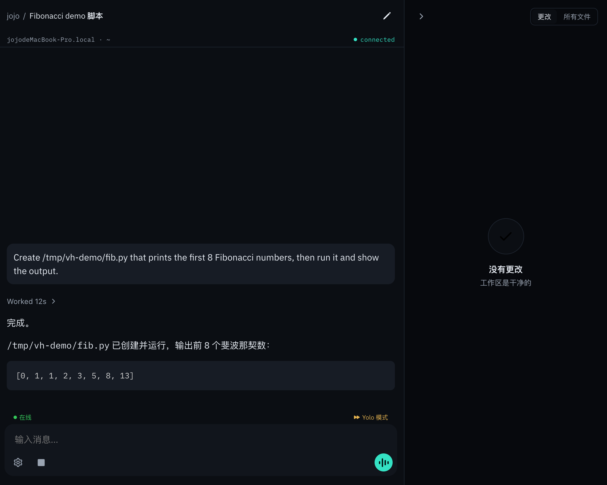
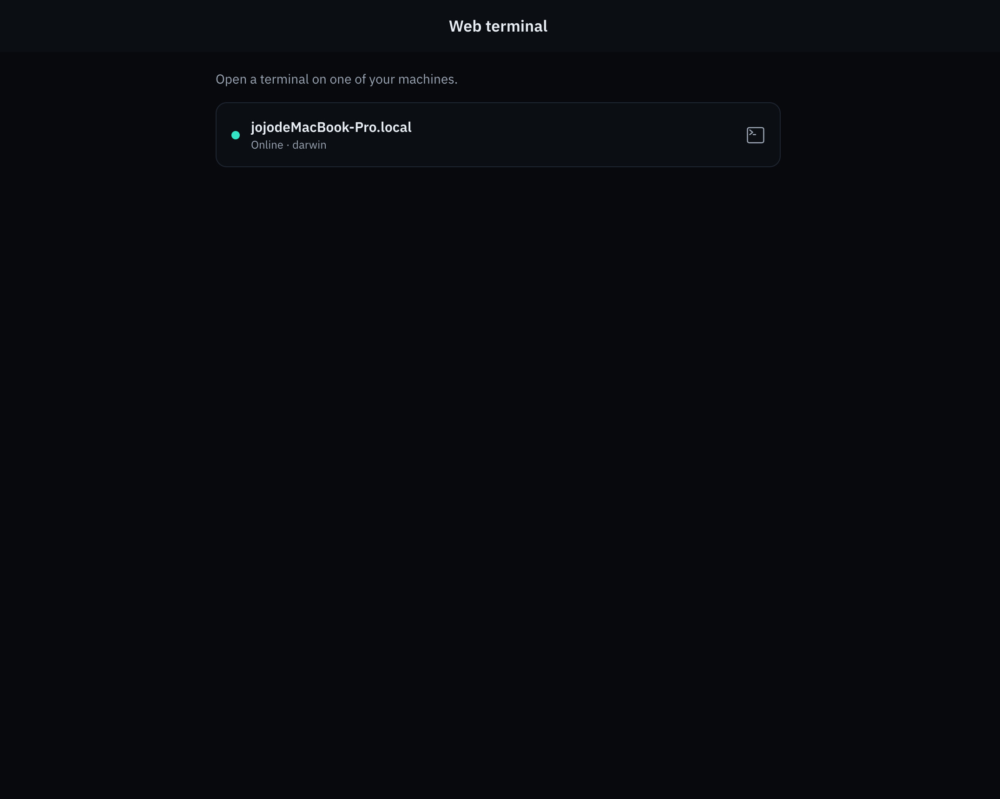

<div align="center">
  <picture>
    <source media="(prefers-color-scheme: dark)" srcset="/.github/logotype-light.png">
    <source media="(prefers-color-scheme: light)" srcset="/.github/logotype-dark.png">
    
  </picture>
</div>

<h1 align="center">Drive Claude Code from any browser</h1>

<p align="center">
  A browser-first control plane for coding agents: continue sessions, answer
  permission prompts, inspect files, and open a real terminal on your machines.
</p>

<p align="center">
  <a href="https://happy.mereith.com">Hosted Cloud</a> ·
  <a href="docs/getting-started.md">Quick start</a> ·
  <a href="docs/README.md">Documentation</a> ·
  <a href="docs/deployment.md">Self-host</a>
</p>

Very Happy is a friendly fork of [slopus/happy](https://github.com/slopus/happy)
with a production Web client, username/password and Google accounts, a browser
terminal, and a self-hostable relay. It keeps the upstream CLI/agent foundation
while deliberately choosing a different trust model for simple multi-device use.

> [!IMPORTANT]
> **Very Happy is server-trusted, not end-to-end encrypted.** The server operator,
> or an attacker controlling the server, can recover account secrets, read relayed
> content, and act toward connected machines with the account's remote-control
> capabilities. Use only an operator you trust. Self-host if you need to control
> that boundary; use upstream Happy if you require its E2E design.

<div align="center">
  
  
</div>

## Quick start

Prerequisites: Node.js 20 or newer, and a working `claude` command on the machine
you want to control.

```bash
npm install -g very-happy-cli
very-happy auth login
very-happy
```

`very-happy auth login` opens a short-lived approval link. Sign in or create an
account, approve only the machine in front of you, then return to the terminal.
Open [happy.mereith.com](https://happy.mereith.com) to create your first session.

The hosted Cloud has a configurable global account capacity and no uptime or
support SLA. Existing accounts can still sign in when new registrations are
closed or full. Do not connect a sensitive machine until you accept the hosted
operator's trust boundary. See [Public Cloud](docs/public-server.md).

## What you get

- Continue Claude Code sessions from desktop, mobile, or an installed PWA.
- Open durable `tmux`-backed browser terminals on connected machines.
- Review tool calls, diffs, files, usage, and permission requests in one UI.
- Receive Web Push or HTTPS webhook notifications.
- Run the relay in one-container PGlite mode or with Postgres/Redis/S3.
- Control signup mode, account capacity, login lifetime, OAuth origins, and
  operational limits through environment variables.

## Architecture

```text
browser ── HTTPS/WebSocket ──> trusted relay ── WebSocket ──> CLI daemon
                                                              │
                                                              └─> Claude Code
```

The wire format still contains encrypted envelopes inherited from Happy, but the
Very Happy server can recover account keys. Transport/storage encryption is
defense in depth; it does not make the relay zero-knowledge. Read the
[architecture](docs/architecture.md) and [security model](docs/security.md)
before operating a public instance.

## Self-host and contribute

- [Self-hosting](docs/deployment.md)
- [Configuration](docs/configuration.md)
- [Upgrading and rollback](docs/upgrading.md)
- [Troubleshooting](docs/troubleshooting.md)
- [Development](docs/development.md)
- [Contributing](docs/CONTRIBUTING.md)
- [Security policy](SECURITY.md)

The production frontend is `packages/happy-web-v2`. The upstream Expo
`packages/happy-app` remains for history and is not a supported Very Happy client.

## Attribution and license

Very Happy is derived from [slopus/happy](https://github.com/slopus/happy) and
retains upstream copyright and MIT terms. See [LICENSE](LICENSE) and
[NOTICE](NOTICE). Claude Code is an Anthropic product; Very Happy is independent
and is not affiliated with Anthropic.
