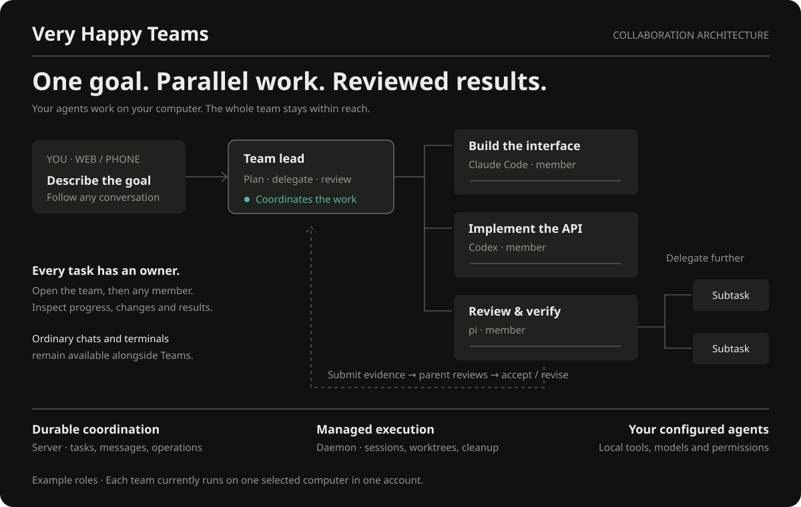

# Very Happy Teams

Give a coding agent a goal and let it organize a team. A lead can delegate
independent tasks to Claude Code, Codex, or pi teammates, follow their progress,
and bring their results back for review. Teammates can delegate child tasks within
their own assignments. You can inspect any member conversation along the way.



Teams is optional. Ordinary conversations, terminals, and history keep working as
before. Each team currently uses one account and one execution computer; automatic
cross-machine routing is not available.

## Prerequisites

- The operator enables `VH_AGENT_TEAMS_ENABLED=true`; deployments may additionally
  restrict `VH_AGENT_TEAMS_ACCOUNT_IDS`. This is account-level access, not a
  machine-specific allowlist.
- The selected machine runs a compatible, online daemon advertising Teams
  capability. Update the CLI and hand over with `very-happy daemon start`; start
  a new managed session to use the new runner tools. Existing wrappers are not
  upgraded in place.
- Configure each coding agent's normal credentials. Teams does not grant provider access.
  Owners choose approval behavior in the team execution settings.
- Use a Git checkout for automatic isolated worktrees. Preserve and integrate
  changes before cleanup; a dirty or unmerged worktree is intentionally retained.

An unavailable/disabled server reports that state. An old daemon cannot receive a
Teams delegation; it does not fall back to Claude or the legacy assistant.

## Start a team in the app

Choose **Teams → New team**, select the project folder and execution computer,
and describe the goal. A compatible daemon starts a managed lead in an isolated
worktree, supplies the official skill, and opens the lead conversation. App users
do not install skills manually. The lead lives for this goal; after acceptance its
session can be cleaned up, while unmerged changes remain preserved.

Team names appear alongside ordinary conversations in history. Expand a team to
open a member conversation, or select its name for goal, progress, and results.
Ordinary conversations are never automatically turned into teams. Appearance
settings can hide the Teams entry without stopping or deleting existing work.

For an existing managed conversation, use **More → Start a team from this
conversation**. Its wrapper establishes the scoped connection and delivers the
collaboration instructions in the background. No session ID entry or additional
join step is required. Old wrappers without the capability need a new session.

Team options choose the default agent/model for new assignments and the maximum
number of concurrently progressing leaf tasks. A parent waiting for unfinished
children yields its slot; this is a work limit, not an OS-process limit. Running
members keep their original model configuration. The current team still uses one
execution computer.

Use a distinct request ID per action and reuse it with identical arguments after
an unknown outcome. Never copy scope tokens into prompts or personal settings.

## Optional: start from a terminal

```sh
very-happy teams install --host claude
# Inspect the reported destination and action, then apply:
very-happy teams install --host claude --apply
# --host codex and --host pi expose the same shared method.
```

All hosts use the one Very Happy-owned skill at
`~/.local/share/very-happy/skills/very-happy-teams/SKILL.md`. The command returns
its absolute path. Ask your managed coding agent to read that path. Installation
does not edit host discovery settings or promise automatic skill discovery; it
does not write through your shared personal skills tree. Edited/unowned files are
not silently overwritten. Uninstall uses the same ownership checks:

```sh
very-happy teams uninstall --host claude
very-happy teams uninstall --host claude --apply
very-happy teams doctor --host pi
```

Doctor describes static setup and relevant environment overrides; it is not a
live model/daemon connectivity test. Reading a skill alone does not attach an
unmanaged process. In particular, use `very-happy pi` for the managed pi path;
a bare `pi` terminal does not gain a background inbox from installation.

## Choose execution mode

In the team page, choose **No approvals** to let newly dispatched agents work without
routine tool prompts. **Ask when needed** keeps the runner's normal approval behavior.
The choice takes effect directly, without a second confirmation. Existing sessions
and already queued operations retain their prior mode; change a live lead's session
mode separately. This does not change global agent settings or provide credentials.

An independent owner terminal can make the same choice:

```sh
very-happy teams permissions --team-id TEAM_ID --mode bypassPermissions --request-id UNIQUE_REQUEST_ID
```

Reuse the request ID on retries. Scoped agent tools cannot change this owner setting.
Team messages appear as compact cards; expand one to inspect the original instructions.

## Scheduled instructions

The Teams page can create a one-time or recurring message to a named bot on the
team machine. Enter a local first-run time and, for repetition, an interval in
whole minutes (minimum one minute). Server state survives daemon restarts; the
daemon delivers to the bound bot, not the most recently active session.

Pause/resume/cancel are version-checked. Cancelling cannot recall a message whose
delivery has already started, and delivery is not proof that the model processed
the instructions. An unavailable recipient retains its pending work rather than
falling back to another bot. Cancel active or paused schedules before archiving.
External task-source mapping and its completion policy still belong to that
source adapter; a schedule by itself does not import or complete Todo items.

## Review and recovery

- A task can be queued, running, submitted, accepted, or cancelled. Idle/blocked/
  exited are separate bot activity events; none of them means a task passed.
- A submitted result requires the owner's acceptance. Returning it creates a new
  attempt. Acceptance/return/cancellation/handoff reference the displayed attempt
  and goal version, so old pages cannot silently act on newer work.
- Cancelling closes the unfinished subtree. Before a parent is submitted or
  handed off, its child work must be resolved. Child completion alone does not
  prove that the parent goal is satisfied.
- A message marked delivered is not a processing acknowledgement from the model.
  Inspect the session and result instead of assuming a notification was handled.
- Cleanup stops only team-created managed workers. User-linked sessions are not
  automatically destroyed; dirty or unmerged team worktrees retain their results.
- When execution is unknown, first cancel or hand off the task as appropriate,
  verify the old process stopped, and preserve/integrate the results. The owner
  can then record **manual reconciliation** with the displayed claim and a note.
  This only records verification; it performs no OS cleanup or automatic respawn.
- Archive after tasks, execution operations, and cleanup are resolved. Archived
  teams leave the active list, while their existing direct links remain readable.

## Migrate from a private supervisor

```sh
very-happy teams migration-preview --file /absolute/path/to/ledger.json
```

The preview is offline: it does not import rows, spawn sessions, or finish Todo
items. Keep the original ledger and mappings as evidence.

1. Inventory and back up old schedules, ledgers, source-task mappings, live
   sessions, and worktrees. A `done`/`stopped` row does not prove resource cleanup.
2. Give every scheduled trigger and external task source an explicit replacement
   before retiring it. Preserve source-task-to-Team-task idempotency mappings;
   decide whether external completion requires acceptance or actual publication.
3. Freeze old dispatch, including an active old meta session, then reconcile its
   in-flight work. Stopping a timer does not stop a model that can still dispatch.
4. Bring work into Teams individually after checking the live session and result.
   Legacy review is not accepted. Finished rows remain history. There is no
   automatic import of active legacy status into a fabricated new attempt.
5. Enable the new writer only after the old writer is stopped for that task
   source. Observe the replacement before removing old configuration; retain a
   read-only archive and a restore path.

The retired tick/ledger cards remain readable as ordinary historical messages.
The separate voice Assistant and old `assistant` sessions remain compatible;
`variant: assistant` is not a Teams role and creates no task ownership. Do not
restart the old coordinator to “repair” a new Teams task.

## Validation boundary

Claude and Codex have completed real mixed-runner edits, commits, scoped result
submission, owner acceptance, and clean resource reclamation in an isolated
stack. Managed pi also completed a real model edit, commit, scoped submission,
individual permission approvals, owner acceptance and cleanup using the official
bridge and fixed pi-acp 0.0.33, without the private supervisor wrapper. A real pi parent also delegated to a Claude child, exchanged messages, reviewed
and merged its result, and submitted to the owner; both levels were accepted and
reclaimed. Cleanup preserved unmerged work and recovered after final integration.
Recursive state and crash fencing have mechanism tests; parent disconnection and
long-term multi-level recovery are not yet established production guarantees. Cross-machine automatic routing, global model budgets, and
long-term unattended operation remain follow-up work.
