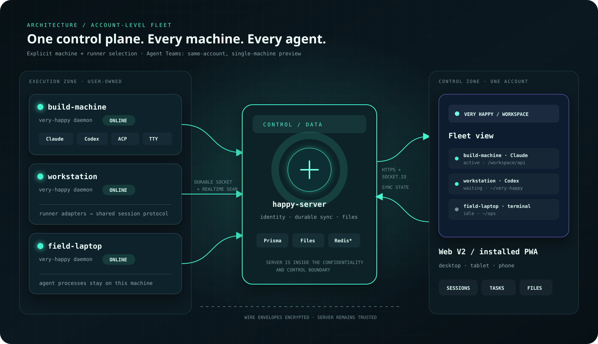
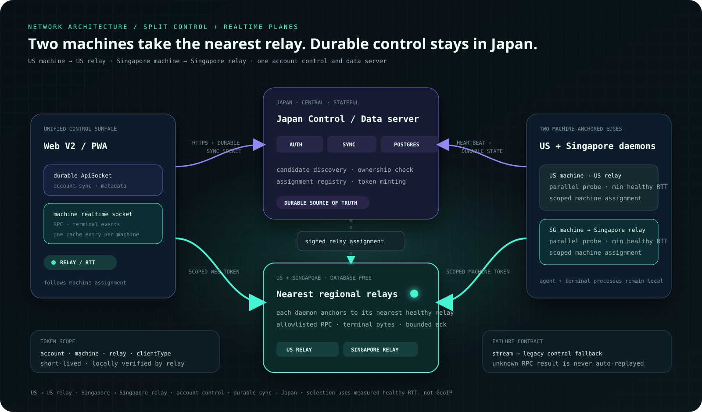
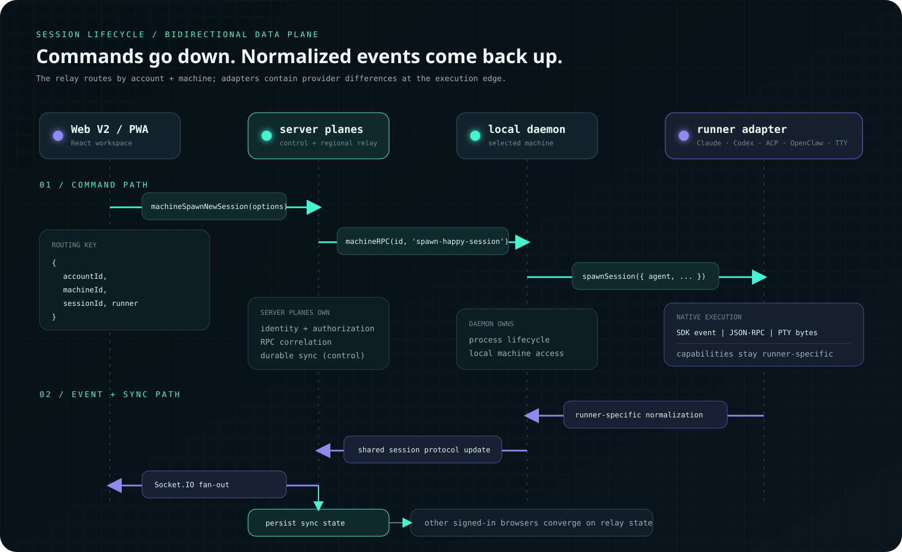
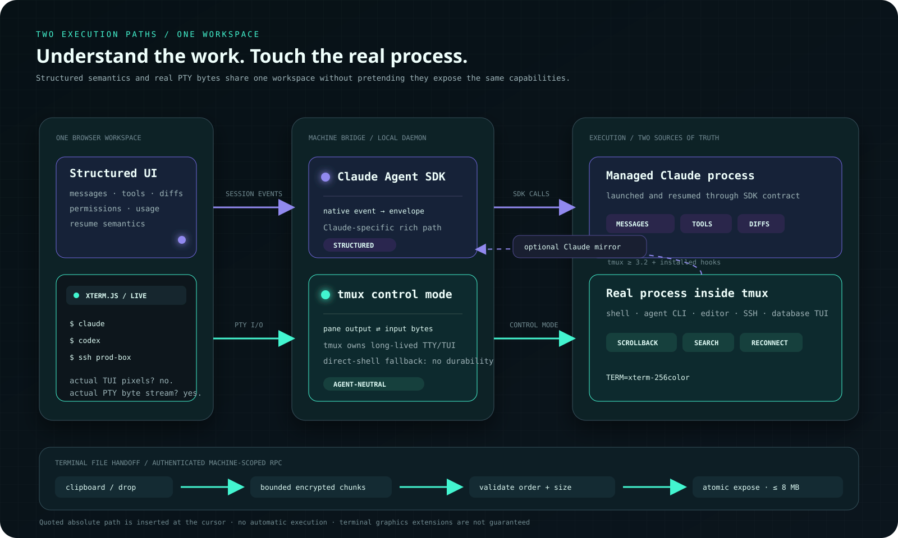

# Architecture and data flow

## Components

The optional voice Meta Agent is currently a Claude coordinator on a selected machine, not a
provider-neutral automatic router. Cross-provider delegation remains roadmap work.

- `packages/happy-web-v2`: production React/Vite browser client.
- `packages/happy-server`: identity, persistence, realtime routing, files,
  notifications, and static Web hosting.
- `packages/happy-cli`: local daemon, agent launcher, terminal bridge, and RPC
  implementation.
- `packages/happy-wire`: shared compatibility schemas.

### Regional realtime relay plane

Latency-sensitive terminal bytes, machine/session RPC, and committed structured
message delivery can leave the central control/data path without moving account
state or PostgreSQL:

The operator supplies a finite relay candidate list. The daemon probes every
healthy candidate in parallel and anchors to the lowest measured RTT; region is
only an operator-facing label, not a GeoIP routing decision. The browser asks
the control plane for that machine's current assignment and connects to the same
relay. Relay tokens are short-lived and scoped to one account, machine, relay,
and client role; session runner tokens additionally bind one session id. A relay
validates them locally and needs no database credential.

Structured messages remain durable-before-execute. Web input reaches the session
runner through the regional relay; that runner writes the same encrypted batch
to the central v3 message API before handing it to the agent. Runner output is
also persisted centrally, then its authoritative encrypted id/seq envelope is
sent directly through the relay to Web. Central updates remain the recovery path
and converge by message id/localId. Session metadata, agent state, usage, history
reads, and attachment objects stay on the control/data plane.

The first version keeps assignments in the single control process with a short
TTL refreshed by daemon heartbeat. Multi-control HA requires moving that registry
to shared storage. Discovery/relay failure falls back to the legacy control
socket during the compatibility window. Future WebRTC DataChannel transport can
occupy the same realtime seam, with regional relay as fallback.

The legacy Expo/Tauri `packages/happy-app` is retained as an experimental seed
for a possible future desktop client. It is not a supported production client in
this release.

### One account, multiple machines

Every daemon connected to the same account feeds one Web/PWA workspace. The
sidebar and task board aggregate sessions and attention state across those
machines, so the user can monitor Claude, Codex, terminal, and other supported
runner sessions without opening a separate control plane per host. Creating a
session explicitly selects its target machine and agent; automatic
provider-neutral routing remains roadmap.

## Identity and connection

Verified email-code, optional password, and verified Google identities map to an `Account`. Web logins receive
expiring, revocable login sessions. Existing CLI tokens remain compatible. A new
machine begins a short-lived pairing request; the signed-in user approves it in
the browser, then the daemon establishes an account-scoped socket.

## Session path

The browser creates or opens a session through the relay. The relay routes RPC
to the account's machine daemon. The daemon selects a provider runner: the
Claude Agent SDK path, the Codex integration, an ACP backend such as Gemini, a
generic ACP command, an OpenClaw gateway adapter, or a local terminal-backed
path. Each runner maps its native events into the shared session protocol and
sends normalized updates back through the relay. The server persists sync state
needed by other browsers.

Provider parity is not implied. Claude currently has the richest structured and
terminal-mirroring experience; Codex, ACP providers, and OpenClaw reuse the
common workspace but expose only the capabilities their runners normalize. See
[session-protocol.md](session-protocol.md) for the provider envelope contract.

### Structured agent path and universal terminal path

Upstream Happy's core Claude flow wraps the Claude Agent SDK to provide a
structured conversation. Very Happy retains that flow and adds a terminal path
whose source of truth is the real agent process:

| Path | Process and transport | Browser experience |
|---|---|---|
| SDK-backed Claude | The daemon calls the Claude Agent SDK and normalizes its events. | Structured messages, tools, diffs, permissions, usage, and resume. |
| tmux-backed terminal | `tmux` owns the long-lived TTY/TUI on the user's machine. A daemon control-mode client carries pane output and input through the trusted relay; xterm renders it in the browser. | The actual Claude Code or other agent CLI/TUI, including reconnect, local scrollback, search, and mobile input. |
| terminal file handoff | The browser sends an authenticated, machine-scoped upload in bounded encrypted RPC chunks through the trusted relay. The daemon validates order and size, writes a temporary file, and atomically exposes it under `~/.happy/uploads/terminal/`. | Paste a clipboard image/file or drop a file, then receive its default-shell-quoted absolute path at the terminal cursor without automatic execution. Current limit: 8 MB per file. |

The terminal transport is intentionally agent-neutral. It forwards a real TTY,
not a coding-agent protocol, so the process may be a shell, editor, Git client,
SSH session, database console, or ordinary xterm-compatible text TUI. Those
processes receive terminal continuity, not synthetic structured agent events.

The terminal is not a screenshot or a browser reimplementation of the agent UI.
The process continues in `tmux` when the browser disconnects. If `tmux` is not
available, the daemon can fall back to a direct shell, but durable background
survival is then unavailable.

The daemon sets `TERM=xterm-256color` and the browser renders with xterm.js.
Common text TUIs are the compatibility target. Terminal-specific graphics and
extensions such as sixel or Kitty graphics are not guaranteed.

The terminal mirror is opt-in and requires `tmux` 3.2 or newer so the daemon can
inject the terminal binding into a newly created session. `very-happy
install-terminal-hooks` merges a SessionStart/SessionEnd pair into Claude's user
settings; it binds only a hand-started Claude process inside a Very Happy
terminal while the daemon is running. `very-happy install-terminal-hooks
--remove` removes Very Happy's entries without removing foreign hooks.
SDK-backed Claude conversations do not depend on this hook pair. The structured
mirror is a Claude integration, not a promise that every terminal-backed agent
exposes equivalent structured events.

## Encryption boundary

Wire envelopes inherited from Happy are still encrypted. Very Happy's account
login requires the server to recover account secrets, so the application server
is inside the confidentiality and control boundary. See [security.md](security.md)
and [encryption.md](encryption.md) for exact formats and limitations.
